# User-Agent Runtime (Live)

```mermaid
flowchart LR
  in[receive_input] --> guard[input_guardrails]
  guard --> load[load_agent_version]
  load --> ctx[load_conversation_context]
  ctx --> mem[read_memory]
  mem --> know[retrieve_knowledge]
  know --> exec[execute_compiled_graph]
  exec --> out[output_guardrails]
  out --> wmem[write_memory]
  wmem --> persist[persist_messages]
  persist --> done[finalize]
```

## Rules

- Load Draft by default; Published when `use_published=true`
- Only compiled allowlisted nodes/tools execute
- External content wrapped as untrusted
- Runs queued so browser disconnect does not stop execution
- Cancel via `POST /v1/runs/{id}/cancel`
