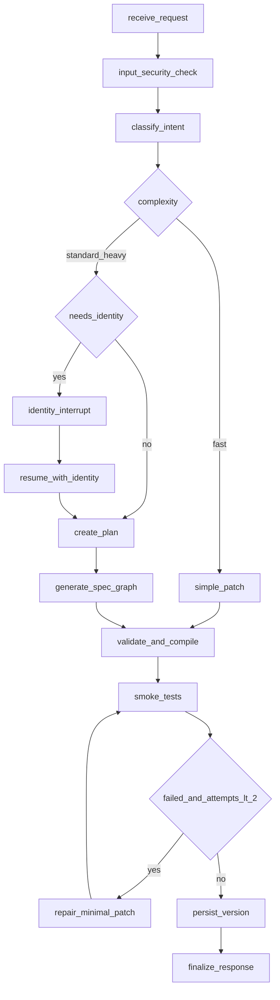

# Builder Orchestrator

## Flow

## Identity interrupt

1. Builder emits assistant message with `ui_component.type = agent_identity_form`.
2. Run stores interrupt in `runs.input.interrupt`.
3. User submits `POST /v1/builder/runs/{run_id}/identity`.
4. Ownership revalidated; agent renamed; build continues.

## Paths

- **Fast**: rename / tone / single rule — one structured update + validate
- **Standard**: tools/memory/behavior changes
- **Heavy**: first creation, branching, multi-tool — specialists + ≤2 repairs
