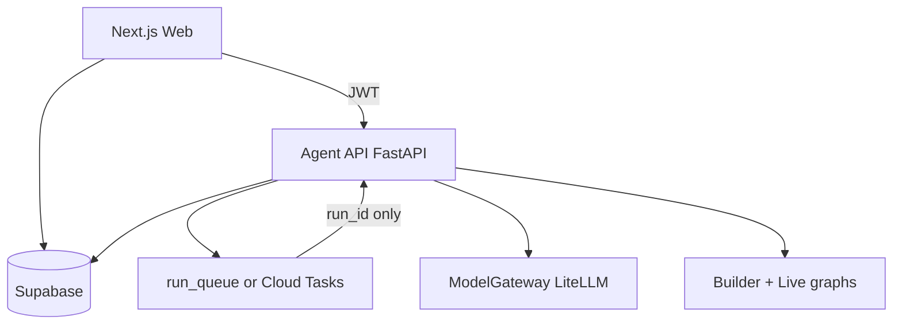

# Phase 3 Architecture

## Components

| Component | Path | Role |
| --- | --- | --- |
| Builder orchestrator | `services/agent-service/agent_service/builder/` | Design agents, identity interrupt, validate, test, repair |
| Live runtime | `services/agent-service/agent_service/runtime/` | Execute compiled AgentSpec |
| GraphCompiler | `services/agent-service/agent_service/compiler/` | Trusted GraphSpec → handlers |
| Model gateway | `services/agent-service/agent_service/gateway/` | LiteLLM profiles + router |
| Tools | `services/agent-service/agent_service/tools/` | Allowlisted MVP tools |
| Memory / Knowledge | `memory/`, `knowledge/` | Conversation + semantic + RAG |
| Queue | `queue/worker.py` | Continues runs after browser disconnect |
| Publish | `publishing/service.py` | Gates + deployments |

## Execution modes

| Mode | Where | Behavior |
| --- | --- | --- |
| `AI_EXECUTION_MODE=mock` (web) | Next.js | Simulated UI progress, persisted |
| `AI_EXECUTION_MODE=agent-service` (web) | Next → Agent API | Real builder/live |
| `AI_EXECUTION_MODE=mock` (agent-service) | LiteLLM bypass | Deterministic mock completions |
| `AI_EXECUTION_MODE=live` (agent-service) | LiteLLM | Real providers |

## Phase 4 boundary

Deferred: OAuth connectors, custom code sandboxes, always-on listeners, Temporal, public agent APIs, marketplace.
See `docs/PHASE_4_BOUNDARIES.md`.
