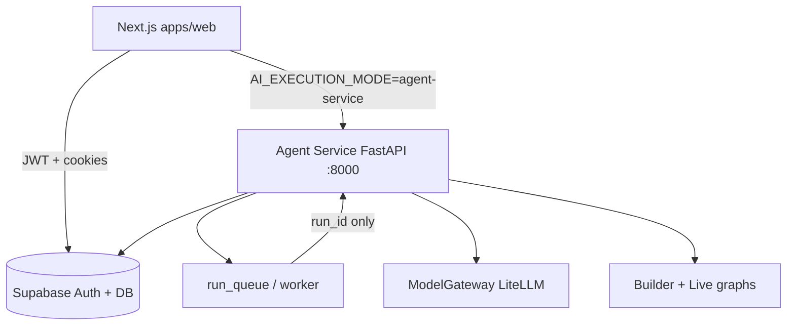

# Phase 3 — Implémentation complète Stack32

_Dernière mise à jour : 2026-08-05_

Ce document résume **toute la logique Phase 3** : architecture, flux Builder (identité → clé LLM → capacités → build), Live BYOK, i18n, sécurité, modèles, et comportement UI (messages séquentiels, formulaires).

Pour le statut opérationnel (clés manquantes, déploiements), voir aussi `docs/PHASE_3_STATUS.md`. Pour le schéma mermaid court, `docs/PHASE_3_ARCHITECTURE.md`.

---

## 1. Objectif produit

Stack32 permet de **créer un agent IA en conversation** (onglet Build), de le **tester en chat** (Live), et de **voir sa structure** (Structure / GraphSpec).

Règles métier Phase 3 :

| Zone | Qui paie les tokens LLM |
| --- | --- |
| **Builder** (conception) | Clés **plateforme** possibles (Stack32) pour générer le spec |
| **Live** (exécution) | **BYOK** — clé API de l’utilisateur, chiffrée, jamais réaffichée en clair |

Pas de framing « crédits Stack32 vs les vôtres » : on dit simplement de connecter un cerveau (LLM) avec une clé API.

---

## 2. Architecture globale



| Couche | Chemin | Rôle |
| --- | --- | --- |
| Web | `apps/web/` | UI Build / Live / Structure, i18n EN/FR, formulaires |
| Agent Service | `services/agent-service/` | Orchestrateur Builder, runtime Live, gateway LLM, secrets |
| Données | `supabase/migrations/` | Agents, threads, messages, versions, secrets, queue |
| Docs | `docs/` | PRD, sécurité, modèles, outils, mémoire, etc. |

---

## 3. Agent Service — modules

Racine : `services/agent-service/agent_service/main.py` (FastAPI, préfixe `/v1`).

| Module | Chemin | Rôle |
| --- | --- | --- |
| **Builder** | `builder/orchestrator.py` | Pipeline create/modify/test/repair ; interrupts ; génération AgentSpec + GraphSpec |
| **Runtime Live** | `runtime/live.py` | Chat live : charge le spec, compile, exécute ; exige BYOK si configuré |
| **Model gateway** | `gateway/model_gateway.py`, `gateway/router.py` | Seule porte LiteLLM ; profiles ; mock/live ; chemin BYOK |
| **Compiler** | `compiler/graph_compiler.py` | GraphSpec → handlers allowlistés (pas d’eval de code modèle) |
| **Security** | `security/` | BYOK Fernet, SSRF, redaction, rate limit, budget LLM |
| **Tools** | `tools/runtime.py` | web_search, fetch_url, knowledge_search, calculator, datetime, structured_output |
| **Memory** | `memory/service.py` | Mémoire conversationnelle + sémantique |
| **Knowledge** | `knowledge/` | Ingestion + RAG |
| **Queue** | `queue/worker.py` | Continue un run après déconnexion navigateur |
| **Publishing** | `publishing/service.py` | Gates validate/compile → version publiée + deployment |
| **Models** | `models/agent_spec.py`, `graph_spec.py` | Schémas Pydantic V2 |
| **Routers** | `routers/*.py` | HTTP builder, secrets, live, agents, runs, knowledge, tasks |

### Endpoints Builder / secrets utiles

- `POST /v1/agents/{id}/builder/messages` — tour Builder
- `POST /v1/builder/runs/{run_id}/identity`
- `POST /v1/builder/runs/{run_id}/secret`
- `POST /v1/builder/runs/{run_id}/capabilities`
- `POST /v1/agents/{id}/secrets/llm` — BYOK hors interrupt (ex. Live)
- `POST /v1/live/threads/{id}/messages`

---

## 4. Flux Builder (conversation guidée)

Ordre **strict** pour un nouvel agent :

```text
Prompt utilisateur
    → thinking (panel « Stack32 travaille… »)
    → Identité (formulaire)
    → Confirmation identité (message)
    → Clé LLM / BYOK (formulaire)
    → Capacités mémoire / docs / planning (formulaire)
    → Build (progress)
    → Ready (suggestions + actions Live / Structure)
```

### 4.1 Identité

1. Classification d’intent + suggestion de nom/rôle (LLM plateforme ou heuristique).
2. Pause ~1,6 s pour laisser le thinking visible.
3. Message `builder:identity.prompt` + `ui_component.type = agent_identity_form`.
4. Interrupt persisté dans `runs.input.interrupt` (`save_builder_interrupt`).
5. Resume `resume_with_identity` → rename agent → message `builder:identity.confirmed` (carte résumé).

### 4.2 Clé API (BYOK)

1. Si aucune clé LLM pour cet agent : `builder:secrets.prompt` + `secret_form`.
2. Providers proposés : OpenAI, Anthropic, Google (Gemini), xAI, Mistral, Groq, OpenRouter.
3. Resume `resume_with_secret` → `upsert_llm_secret` (Fernet) → audit → clear interrupt.
4. **Pas** de message « saved » séparé : enchaîne directement sur les capacités avec `builder:capabilities.promptAfterSecret` (un seul tour de conversation + formulaire).

### 4.3 Capacités

1. Toggles : mémoire conversation, mémoire long terme, knowledge, schedule horaire + notes libres.
2. Resume `resume_with_capabilities` → message `builder:capabilities.saved` → `_continue_build`.

### 4.4 Build → Ready

1. Plan / architecture → génération AgentSpec + GraphSpec.
2. Validate + compile (GraphCompiler).
3. Smoke tests ; repair ≤ 2 fois si échec.
4. Persist `agent_versions` ; status agent → `ready`.
5. Message ready (`card: ready`, suggestions i18n, éventuellement `playReadySound`).

### 4.5 IDs de formulaires (important)

Chaque formulaire a un **`request_id` UUID unique**.  
Le run Builder reste dans **`interrupt_run_id`** (= `run_id`).

Pourquoi : si tous les forms réutilisaient `run_id` comme `request_id`, le frontend marquait l’id « résolu » après le 1er formulaire et **cachait** le suivant (ex. capacités invisibles après la clé API).

`resolve_builder_form` côté DB matche encore via `request_id` **ou** `interrupt_run_id`.

---

## 5. Comportement UI (Build)

Fichier central : `apps/web/components/builder/build-view.tsx`.

### 5.1 Messages séquentiels

Le backend peut insérer **plusieurs** messages assistant dans la même requête HTTP.  
L’UI ne les anime **pas** en parallèle :

1. Les messages déjà présents au premier chargement = historique (pas de typewriter).
2. Les nouveaux messages assistant entrent dans une **file** (`activeRevealId` / `revealedIds`).
3. Un seul bubble à la fois : typewriter → pause ~650 ms → message suivant.
4. Le formulaire d’un message n’apparaît qu’**après** la fin du texte de ce message.

### 5.2 Formulaires

| Type | Composant | Action |
| --- | --- | --- |
| `agent_identity_form` | `agent-identity-form.tsx` | `submitBuilderIdentity` |
| `secret_form` | `secret-form.tsx` | `submitBuilderSecret` / Live |
| `agent_capabilities_form` | `agent-capabilities-form.tsx` | `submitBuilderCapabilities` |

`resolvedFormIds` ne stocke que le **`uiComponent.requestId`** (jamais l’interrupt run id partagé).

### 5.3 Autres composants

| Fichier | Rôle |
| --- | --- |
| `ready-card.tsx` | Ready + `IdentityConfirmedMessage` |
| `build-progress-panel.tsx` | Avancement build |
| `builder-working-panel.tsx` | Overlay / panel « travaille… » |
| `message-motion.tsx` | Entrée + typewriter |
| `live-view.tsx` | Chat Live + éventuel secret_form |
| `structure-view.tsx` / `structure-graph.tsx` | Visualisation GraphSpec |
| `agent-sidebar.tsx` | Liste agents + overlay création |

Polling : `hooks/use-builder.ts` (~700 ms tant que le thread est actif).

---

## 6. Langue (i18n)

- Locales supportées : **`en`**, **`fr`** (`apps/web/lib/i18n/locales.ts`).
- Sélecteur : `components/shared/language-switcher.tsx` (cookie + localStorage).
- Le **backend ne localise pas** : il persiste des clés `builder:…` / `live:…`.
- Le frontend traduit avec `t(message.content)` si le contenu commence par `builder:` ou `live:`.

| Locale UI | Langue des messages Builder |
| --- | --- |
| Français choisi | Textes de `locales/fr/builder.json` |
| English choisi | Textes de `locales/en/builder.json` |

Locale par défaut au premier visit : **`en`**. Pour parler français, l’utilisateur doit choisir Français dans le switcher (persisté).

Clés importantes : `identity.*`, `secrets.*`, `capabilities.prompt`, `capabilities.promptAfterSecret`, `ready.*`, `steps.*`, `progress.*`.

---

## 7. AgentSpec ↔ GraphSpec

- **AgentSpec** (`models/agent_spec.py`) : identité, goal, instructions, tools, knowledge, memory, rules, model_policy, security, runtime… et **`graph: GraphSpec`**.
- **GraphSpec** (`models/graph_spec.py`) : nœuds (`input`, `llm`, `tool`, `knowledge`, `memory_*`, `output`…) + edges + `entry_node_id`.
- Le **compiler** transforme le graph en handlers de confiance.
- **Structure UI** affiche le graph ; **Live** l’exécute avec le contexte AgentSpec.

Garde-fous build : profondeur de branche limitée (outils en parallèle plutôt qu’une chaîne trop longue), max d’appels LLM par run, timeouts, budget mensuel / `usage_events`.

---

## 8. Model gateway & coding

Profiles : `fast`, `balanced`, `reasoning`, `coding`, `validator`, `embedding`.

BYOK Live : `_model_for_provider_profile(provider, profile)` mappe provider → modèle LiteLLM (OpenAI, Anthropic, Gemini/Google, xAI, Mistral, Groq, OpenRouter).

Coding (Builder) : profiles coding (ex. Codex / Grok Code selon `MODEL_*` env) pour blueprint / architecture / repair.

Config modèles : `services/model-gateway/config/models.yaml` + env `MODEL_*_PRIMARY/FALLBACK`.

---

## 9. Sécurité BYOK

| Élément | Détail |
| --- | --- |
| Table | `user_secrets` (ciphertext service-role only) |
| Crypto | Fernet via `SECRETS_ENCRYPTION_KEY` |
| Hint | Seul un aperçu masqué est stocké / montré |
| Live | `LIVE_REQUIRE_USER_LLM_KEY=true` → pas de clé plateforme en Live |
| Audit | `secret_upsert` dans les events d’audit |

---

## 10. Modèle de données (extrait Phase 3)

| Table / stockage | Rôle |
| --- | --- |
| `builder_messages` | Conversation Build ; `content` = clé i18n ou texte ; `metadata` = ui_component, card, interrupt_run_id |
| `runs.input.interrupt` | Interrupt ouvert (pas de table dédiée) |
| `user_secrets` | Clés LLM chiffrées |
| `agent_versions` + `graph_spec` | Spec versionné |
| `agent_memories` | Mémoire sémantique |
| `agent_deployments` | Publish |
| `run_queue` | Continuité async |
| `usage_events` | Coûts / usage |
| `agents.first_ready_*` | Première célébration Ready |

---

## 11. Variables d’environnement critiques

| Variable | Où | Effet |
| --- | --- | --- |
| `AI_EXECUTION_MODE` | **web** `mock` \| `disabled` \| `agent-service` | Mock local vs Agent API |
| `AI_EXECUTION_MODE` | **agent-service** `live` \| `mock` \| `disabled` | Vrais LLM / mock / off |
| `LIVE_REQUIRE_USER_LLM_KEY` | agent-service (défaut true) | Live exige BYOK |
| `SECRETS_ENCRYPTION_KEY` | agent-service | Chiffrement BYOK (obligatoire prod) |
| `OPENAI_API_KEY`, `XAI_API_KEY`, … | agent-service | Clés plateforme Builder |
| `MODEL_*_PRIMARY/FALLBACK` | agent-service | Choix de modèles par profile |
| `WEB_SEARCH_API_KEY` | agent-service | Outil web_search |
| `DATABASE_URL` / Supabase | les deux | Persistance |

Paire typique dev réel : web=`agent-service` + service=`live`.

---

## 12. Commandes locales

```bash
# Web
pnpm dev:web          # http://localhost:3000

# Agent service
pnpm dev:agent        # http://localhost:8000

# Supabase local (optionnel)
pnpm supabase:start
```

---

## 13. Correctifs UX récents (août 2026)

| Problème | Cause | Correctif |
| --- | --- | --- |
| Deux messages + typewriters en même temps | Poll livre un batch ; chaque bubble animait en parallèle | File de révélation séquentielle dans `build-view.tsx` |
| Formulaire capacités absent / retard | Même `request_id` (= run_id) pour tous les forms → `resolvedFormIds` cachait le suivant | UUID unique par form ; `resolvedFormIds` = form id seulement |
| « Saved » + « Choose » sans clarté | Deux messages d’affilée, form parfois masqué | Un message `promptAfterSecret` + form ; copy plus conversationnelle |
| Langue | Textes via i18n ; défaut `en` | Switcher FR/EN ; clés `builder:` traduites selon locale |

---

## 14. Frontière Phase 4

Différé (voir `docs/PHASE_4_BOUNDARIES.md`) :

- Connecteurs OAuth (Gmail, Slack, Drive…)
- Sandboxes de code custom
- Listeners always-on / Temporal
- APIs agents publiques / marketplace
- Déploiement GCP staging complet (Terraform scaffoldé)

---

## 15. Index docs liées

| Doc | Contenu |
| --- | --- |
| `docs/PHASE_3_ARCHITECTURE.md` | Schéma composants |
| `docs/PHASE_3_STATUS.md` | Statut opérationnel |
| `docs/BUILDER_ORCHESTRATOR.md` | Détail orchestrateur |
| `docs/AGENT_SPEC_V2.md` / `GRAPH_SPEC.md` / `GRAPH_COMPILER.md` | Specs |
| `docs/MODEL_GATEWAY.md` / `MODEL_CONFIGURATION.md` | LLM |
| `docs/MEMORY.md` / `KNOWLEDGE_RAG.md` / `TOOLS.md` | Runtime |
| `docs/SECURITY.md` + `docs/security/*` | Sécurité |
| `docs/COST_CONTROLS.md` | Budgets / usage |
| `docs/STACK32_PRD_MVP.md` | Produit |

---

*Ce fichier est la vue d’ensemble « comment ça marche » de la Phase 3 telle qu’implémentée dans le monorepo Stack32.*
